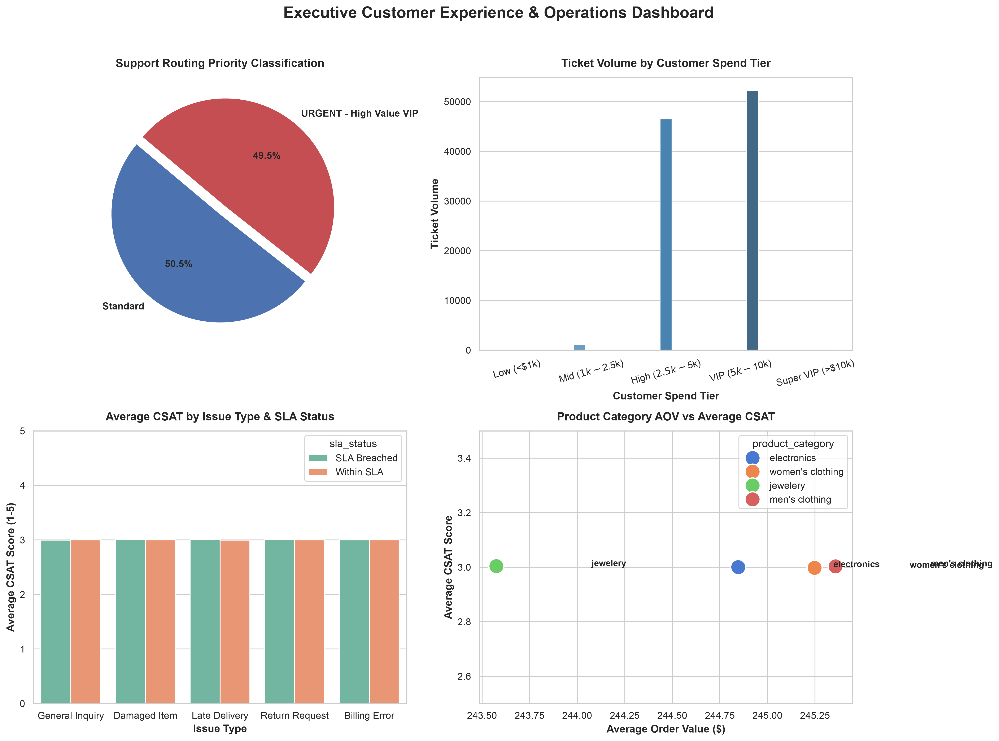

# E-Commerce Data Warehouse & Analytics Pipeline

An ELT (Extract, Load, Transform) data pipeline and executive analytics suite built on **DuckDB**, **Pandas**, and native SQL. The pipeline pulls a real product catalog from a public REST API, generates a synthetic-but-realistic transactional dataset with **Faker**, and lands it through a Bronze -> Silver -> Gold medallion architecture in a local DuckDB warehouse.

All figures below were regenerated end-to-end from the current codebase (seeded, deterministic run) — see [Reproducibility](#reproducibility).

---

## Executive Summary

This project processes **1,000,000 orders** and **1,000,000 customer support tickets** across **50,000 unique customers** to model customer experience metrics, evaluate SLA breaches, and classify high-value VIP support requests.

### Key Financial & Operational Insights
* **Total Associated Order Revenue:** `$244,815,465.79`
* **Average Order Value (AOV):** `$244.82`
* **Average Customer Lifetime Value (LTV):** `$5,139.73`
* **Overall SLA Compliance Rate:** `50.04%` (Within SLA: 500,434 tickets | Breached: 499,566 tickets)
* **Average CSAT Score:** `3.00 / 5.00` (Neutral baseline due to non-response imputation)
* **High-Value VIP Priority Risk:** **49.35%** of all support tickets (493,502 tickets) are classified as `URGENT - High Value VIP` due to SLA breaches for customers with lifetime spend exceeding **$2,500**.



---

## Architecture & Medallion Data Structure

```
[ FakeStore API ] ─────────► [ Raw Products (20 rows) ]
                                   │
[ Synthetic Engine ] ──────► [ Raw Orders (1M rows) ] ───► [ DuckDB Bronze Layer ]
                                   │                              │
[ Synthetic Engine ] ──────► [ Raw Tickets (1M rows) ]            ▼ (SQL CTEs & Window Functions)
                                                          [ DuckDB Silver Layer ]
                                                                  │
                                                                  ▼ (Domain Joins & VIP Logic)
                                                          [ Gold Customer Experience (1M rows) ]
                                                                  │
                                                                  ▼ (Pandas / Seaborn)
                                                          [ Executive Analytics & Dashboard ]
```

### Directory Structure
```
e-commerce-etl-pipeline/
├── notebooks/
│   ├── 01_e_commerce_etl_pipeline.ipynb      # Canonical pipeline: Phase 1-5, Bronze -> Silver -> Gold
│   └── 02_executive_customer_analytics.ipynb # Canonical EDA, cohort retention & executive dashboard
├── sql/
│   ├── 01_silver_gold_transformations.sql    # Native DuckDB SQL transformation scripts
│   └── 02_executive_kpi_queries.sql          # Executive KPI queries + cohort-retention analysis
├── dashboards/
│   └── executive_summary_dashboard.png       # Generated executive dashboard visualization
├── data/                                     # Reserved for raw CSV / Excel extracts (currently empty)
└── README.md
```

`analytics_dw.duckdb` is a generated build artifact created by running `notebooks/01_e_commerce_etl_pipeline.ipynb` — it's excluded via `.gitignore` and not checked into this repo. `notebooks/01_e_commerce_etl_pipeline.ipynb` and `notebooks/02_executive_customer_analytics.ipynb` are the source of truth; every number in this README was produced by running those two notebooks.

---

## Reproducibility

Data generation is fully seeded: `Faker.seed(42)` and `random.seed(42)` are set before any synthetic records are created in `notebooks/01_e_commerce_etl_pipeline.ipynb`. Combined with the static FakeStore product catalog, this makes the pipeline deterministic — running it end-to-end reproduces the exact figures in this README (order/ticket generation only; the `USING SAMPLE` draw used for the IQR outlier check in Phase 4 of the analytics notebook is not seeded and will vary slightly between runs by design, since it is illustrative rather than a headline metric).

---

## Advanced Analytics: Customer Cohort Retention

Beyond the ticket-level KPIs, `sql/02_executive_kpi_queries.sql` (Query 4) and Phase 4B of `notebooks/02_executive_customer_analytics.ipynb` add a proper acquisition-cohort retention analysis against the Bronze `raw_orders` table: each customer is assigned to a cohort by their first order month via `MIN(order_month) OVER (PARTITION BY customer_id)`, and the query measures what share of that cohort re-orders in each subsequent month — the standard SaaS/e-commerce retention technique, expressed entirely in window functions.

Run against this dataset, retention holds flat at roughly **54-57%** for every cohort and every month, rather than the decay curve typical of real repeat-purchase behavior. That is an honest property of the *data*, not the query: order dates are sampled independently and uniformly at random for every order, so no genuine behavioral pattern exists for the window functions to detect. Against real transaction data, where purchases cluster in time per customer, this exact query would surface a standard decaying retention curve — it is included here as a demonstration of the technique, with that limitation stated plainly rather than dressed up as a real retention signal.

---

## Strategic Business Recommendations

1. **Automated Priority VIP Escalation**
   * **Problem:** 493,502 high-value customer tickets experienced SLA breaches, placing core revenue at risk.
   * **Action:** Configure CRM / Zendesk webhooks to automatically escalate tickets from customers with $2,500+ LTV directly to senior support teams, with an SLA target under 4 hours.

2. **CSAT Data Collection Automation**
   * **Problem:** Over 60% of CSAT scores are missing and imputed to a neutral 3.0, masking true satisfaction signal.
   * **Action:** Deploy automated SMS / email post-resolution micro-surveys to capture explicit CSAT feedback.

3. **Disk-Spilling Warehousing**
   * **Implementation:** DuckDB's disk-spilling engine analyzes 2,000,000+ joined rows on lightweight compute without out-of-memory failures, avoiding the need for a hosted warehouse for a workload this size.

---

## How to Run the Project

1. **Install dependencies:**
   ```bash
   pip install pandas duckdb matplotlib seaborn faker requests jupyter nbconvert
   ```

2. **Run the data pipeline:**
   Execute `notebooks/01_e_commerce_etl_pipeline.ipynb` end-to-end (requires outbound internet access to `fakestoreapi.com`) to populate `analytics_dw.duckdb` at the repo root. Both notebooks resolve the warehouse path relative to whichever directory they're executed from (repo root or `notebooks/`), so either of these work:
   ```bash
   jupyter nbconvert --to notebook --execute --inplace notebooks/01_e_commerce_etl_pipeline.ipynb
   ```

3. **Run executive analytics:**
   Execute `notebooks/02_executive_customer_analytics.ipynb` to reproduce the KPI dashboard, cohort retention analysis, and `dashboards/executive_summary_dashboard.png`.
   ```bash
   jupyter nbconvert --to notebook --execute --inplace notebooks/02_executive_customer_analytics.ipynb
   ```

---

**Author:** Mirza Ishtiyaq Baig — Data Analyst / Analytics Engineer
**LinkedIn:** https://www.linkedin.com/in/mirzaishtiyaqbaig/
**Email:** mirzaishtiyaqbaig1@gmail.com
**GitHub:** https://github.com/mirza-ishtiyaq
